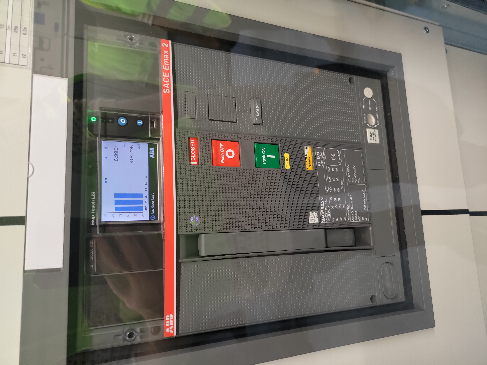

<!--more-->

## Introduction

Many thank to VBZ for inviting me to tour their bus charging stations and garage. This blog post consist mostly of pictures. Sadly my phone doesn't do a very good job in low light so some of these may be a bit blurry.

This garage has been used since 1969 and currently does maintenance of around 170 buses from small ones to the double bendy "Trolly" buses.

## The main basement hall

# Electrical Systems

## The Garage
