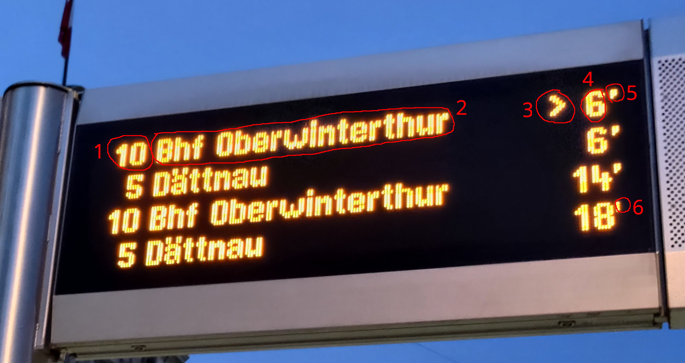
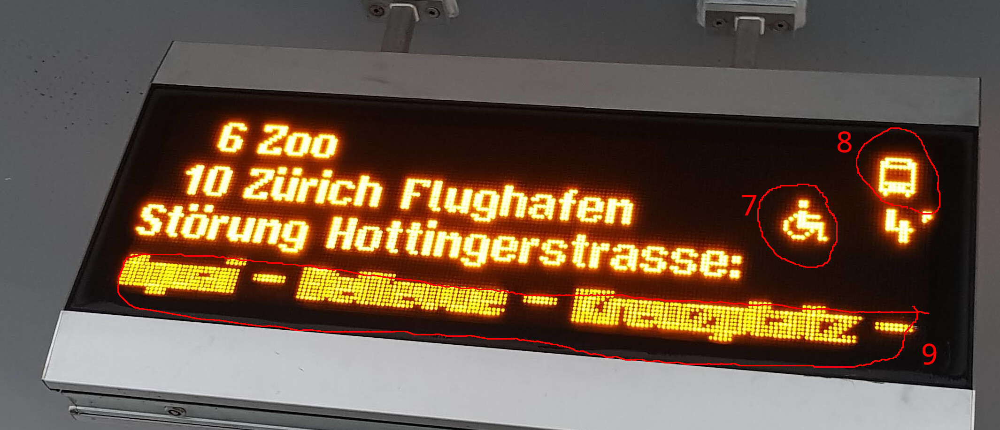
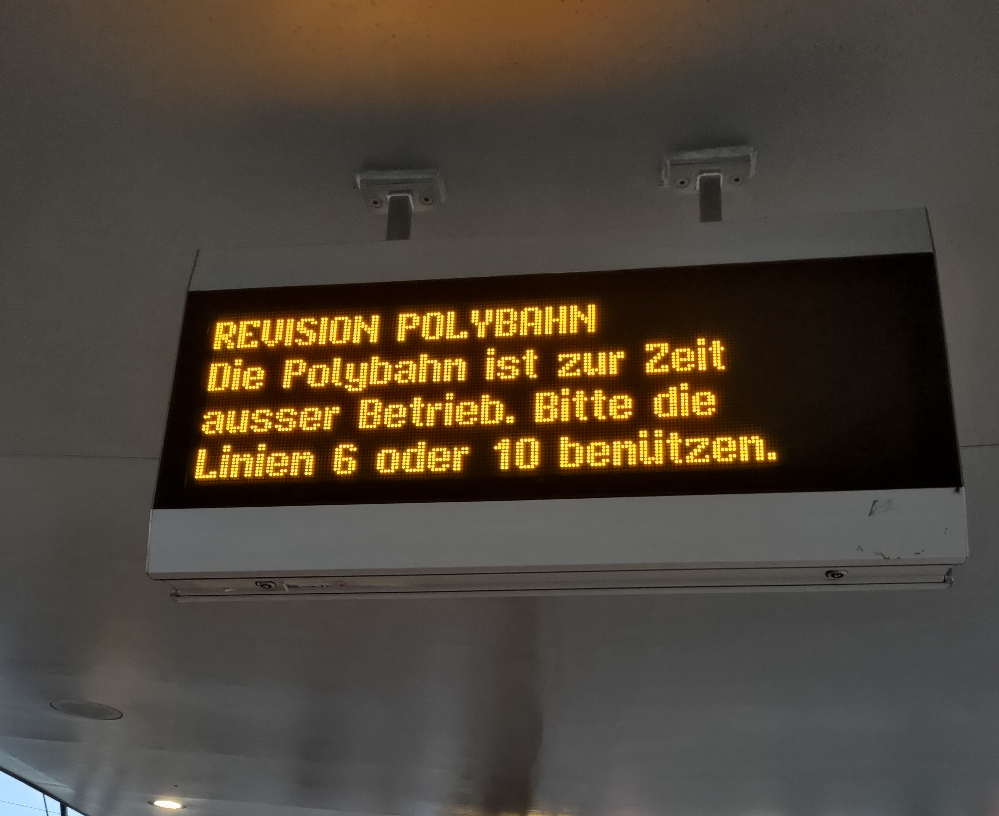
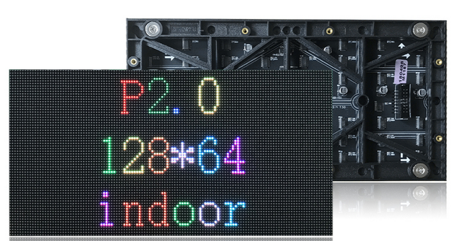
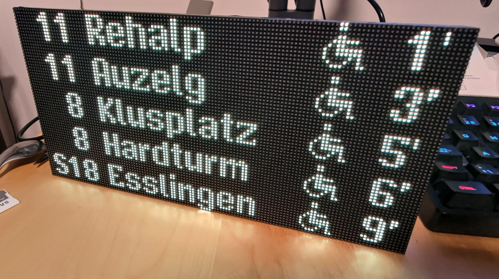

<!--more-->

## Goal

I love these LED style signs that are all over the city of Zürich to show when the next tram/bus is about to arrive.

Since such a sign is not available for purchase I decided to build my own small desk/wall version.

## Analysis

This is what I was able to gather, may not be 100% correct.



1.  The line number, can also container letters such as "S"
2.  The destination
3.  "Greater than" shown when there is a significant delay from the schedule (+3min?)
4.  Minutes until departure
5.  Backtick indicating live data
6.  Tic indicating scheduled data.



7.  Icon indicating level entry on this tram/bus
8.  Icon indication the tram/bus is leaving now (at station)
9.  Extra information that is scrolled when there is an issue



These signs appear to be 56 x 208 single color (Amber) with a dot pitch of around 2mm.

## Building

### Getting the data

Switzerland provides an [api](https://opentransportdata.swiss) for public transportation data. This allows anyone to connect to this data and build on top of it. You do however have certain [limits](https://opentransportdata.swiss/de/terms-of-use/) depending on what account type you have. The free account lets you hit the API twice a minute which is enough for what I want. I can also get the live data for the current position of the trams/busses easily via the API.

To use the data you need to make a free account here: https://opentransportdata.swiss/de/register/ and generate an API key.

You can then make simple GET or POST request. I am using the API point https://api.opentransportdata.swiss/trias2020 which is specific for the kind of station data I want.

Important items in the xml are:

- **RequestTimestamp**: Now
- **StopPointRef**: The station for which I want the data. This is ID can be looked up from the list available here: https://opentransportdata.swiss/de/dataset/bav_liste
- **DepArrTime**: The time for which I want the data (generally now)
- **NumberOfResults**: How many results I want (useful to not run out of memory on the ESP)
- **StopEventType**: I only want departures not arrivals
- **IncludeRealtimeData**: If available I would like realtime data as well


curl -XPOST \
-H "Authorization: XXXXXXXX" \
-H "Content-Type: text/XML" \
https://api.opentransportdata.swiss/trias2020 \
-d '<?xml version="1.0" encoding="UTF-8"?>
<Trias version="1.1"
    xmlns="http://www.vdv.de/trias"
    xmlns:siri="http://www.siri.org.uk/siri"
    xmlns:xsi="http://www.w3.org/2001/XMLSchema-instance">
<ServiceRequest>
<siri:RequestTimestamp>2022-11-04T16:01:06.488Z</siri:RequestTimestamp>
<siri:RequestorRef>API-Explorer</siri:RequestorRef>
<RequestPayload>
<StopEventRequest>
<Location>
<LocationRef>
<StopPointRef>8576193</StopPointRef>
</LocationRef>
<DepArrTime>2022-11-04T17:00:56</DepArrTime>
</Location>
<Params>
<NumberOfResults>4</NumberOfResults>
<StopEventType>departure</StopEventType>
<IncludePreviousCalls>false</IncludePreviousCalls>
<IncludeOnwardCalls>false</IncludeOnwardCalls>
<IncludeRealtimeData>true</IncludeRealtimeData>
</Params>
</StopEventRequest>
</RequestPayload>
</ServiceRequest>
</Trias>'


You will get a response similar to this:

From which I am interested in:

- **TimetabledTime**: The scheduled time
- **EstimatedTime**: The actual time (may not be available)
- **A\_\_NF**: Does the tram/bus have level entry
- **DestinationText**: Destination



<?xml version="1.0" encoding="UTF-8"?>

<trias:Trias xmlns:siri="http://www.siri.org.uk/siri"
xmlns:trias="http://www.vdv.de/trias"
xmlns:acsb="http://www.ifopt.org.uk/acsb"
xmlns:ifopt="http://www.ifopt.org.uk/ifopt"
xmlns:datex2="http://datex2.eu/schema/1_0/1_0" version="1.1">
<trias:ServiceDelivery>
<siri:ResponseTimestamp>2022-11-06T14:49:26Z</siri:ResponseTimestamp>
<siri:ProducerRef>EFAController10.5.16.20-OJP-EFA01-P</siri:ProducerRef>
<siri:Status>true</siri:Status>
<trias:Language>de</trias:Language>
<trias:CalcTime>68</trias:CalcTime>
<trias:DeliveryPayload>
<trias:StopEventResponse>
<trias:StopEventResponseContext>
<trias:Situations></trias:Situations>
</trias:StopEventResponseContext>
<trias:StopEventResult>
<trias:ResultId>ID-3CBAF30F-2E89-47F2-8A1B-39684A2F1680</trias:ResultId>
<trias:StopEvent>
<trias:ThisCall>
<trias:CallAtStop>
<trias:StopPointRef>8576193</trias:StopPointRef>
<trias:StopPointName>
<trias:Text>Zürich, Bellevue</trias:Text>
<trias:Language>de</trias:Language>
</trias:StopPointName>
<trias:ServiceDeparture>
<trias:TimetabledTime>2022-11-04T16:00:00Z</trias:TimetabledTime>
<trias:EstimatedTime>2022-11-04T16:00:00Z</trias:EstimatedTime>
</trias:ServiceDeparture>
<trias:StopSeqNumber>8</trias:StopSeqNumber>
</trias:CallAtStop>
</trias:ThisCall>
<trias:Service>
<trias:OperatingDayRef>2022-11-04</trias:OperatingDayRef>
<trias:JourneyRef>ojp:91002::R:j22:780:22002</trias:JourneyRef>
<trias:LineRef>ojp:91002::R</trias:LineRef>
<trias:DirectionRef>return</trias:DirectionRef>
<trias:Mode>
<trias:PtMode>tram</trias:PtMode>
<trias:TramSubmode>cityTram</trias:TramSubmode>
<trias:Name>
<trias:Text>Tram</trias:Text>
<trias:Language>de</trias:Language>
</trias:Name>
</trias:Mode>
<trias:PublishedLineName>
<trias:Text>2</trias:Text>
<trias:Language>de</trias:Language>
</trias:PublishedLineName>
<trias:OperatorRef>ojp:3849</trias:OperatorRef>
<trias:Attribute>
<trias:Text>
<trias:Text>Niederflureinstieg</trias:Text>
<trias:Language>de</trias:Language>
</trias:Text>
<trias:Code>A\_\_NF</trias:Code>
</trias:Attribute>
<trias:OriginStopPointRef>8576182</trias:OriginStopPointRef>
<trias:OriginText>
<trias:Text>Zürich Tiefenbrunnen, Bahnhof</trias:Text>
<trias:Language>de</trias:Language>
</trias:OriginText>
<trias:DestinationStopPointRef>8596007</trias:DestinationStopPointRef>
<trias:DestinationText>
<trias:Text>Schlieren, Geissweid</trias:Text>
<trias:Language>de</trias:Language>
</trias:DestinationText>
</trias:Service>
</trias:StopEvent>
</trias:StopEventResult>
</trias:StopEventResponse>
</trias:DeliveryPayload>
</trias:ServiceDelivery>
</trias:Trias>


### The Font

These displays have a very unique font and I wanted it to be identical. The only way to achieve this was to build a font from scratch using photos I made of different routes and if I was lucky extra messages with rare characters.

```
░░ ▓▓ ▓▓ ▓▓ ▓▓ ▓▓ ▓▓ ░░ 12
▓▓ ░░ ░░ ░░ ░░ ░░ ░░ ▓▓ 11
▓▓ ▓▓ ▓▓ ▓▓ ▓▓ ▓▓ ▓▓ ▓▓ 10
▓▓ ░░ ░░ ░░ ░░ ░░ ░░ ▓▓ 9
▓▓ ░░ ░░ ░░ ░░ ░░ ░░ ▓▓ 8
▓▓ ░░ ░░ ░░ ░░ ░░ ░░ ▓▓ 7
▓▓ ░░ ░░ ░░ ░░ ░░ ░░ ▓▓ 6
▓▓ ▓▓ ▓▓ ▓▓ ▓▓ ▓▓ ▓▓ ▓▓ 5
▓▓ ░░ ▓▓ ▓▓ ▓▓ ▓▓ ░░ ▓▓ 4
▓▓ ▓▓ ▓▓ ▓▓ ▓▓ ▓▓ ▓▓ ▓▓ 3
░░ ▓▓ ░░ ░░ ░░ ░░ ▓▓ ░░ 2
░░ ░░ ░░ ░░ ░░ ░░ ░░ ░░ 1
1  2  3  4  5  6  7  8
```

- At Station Icon, is shown when the time to arrival is 0

```
░░ ░░ ░░ ▓▓ ▓▓ ░░ ░░ ░░ ░░ ░░ 12
░░ ░░ ░░ ▓▓ ▓▓ ░░ ░░ ░░ ░░ ░░ 11
░░ ░░ ░░ ░░ ░░ ░░ ░░ ░░ ░░ ░░ 10
░░ ░░ ░░ ▓▓ ▓▓ ░░ ░░ ░░ ░░ ░░ 9
░░ ░░ ▓▓ ▓▓ ▓▓ ▓▓ ▓▓ ▓▓ ░░ ░░ 8
░░ ▓▓ ░░ ▓▓ ▓▓ ░░ ░░ ░░ ░░ ░░ 7
▓▓ ░░ ░░ ▓▓ ▓▓ ▓▓ ▓▓ ▓▓ ▓▓ ░░ 6
▓▓ ░░ ░░ ▓▓ ▓▓ ▓▓ ▓▓ ▓▓ ▓▓ ░░ 5
▓▓ ░░ ░░ ░░ ░░ ░░ ▓▓ ░░ ▓▓ ░░ 4
░░ ▓▓ ░░ ░░ ░░ ▓▓ ░░ ░░ ▓▓ ░░ 3
░░ ░░ ▓▓ ▓▓ ▓▓ ░░ ░░ ░░ ▓▓ ▓▓ 2
░░ ░░ ░░ ░░ ░░ ░░ ░░ ░░ ░░ ░░ 1
1  2  3  4  5  6  7  8  9  10
```

- Accessibility Icon, shown for buses and trams with level entry.
- This also appears to be largest symbol

```
░░ ░░ ░░ ░░ ░░ ░░ ░░ ▓▓ ▓▓ ░░ ░░ ▓▓ ▓▓ 12
▓▓ ▓▓ ▓▓ ▓▓ ▓▓ ▓▓ ░░ ▓▓ ▓▓ ░░ ░░ ▓▓ ▓▓ 11
▓▓ ▓▓ ░░ ░░ ▓▓ ▓▓ ░░ ░░ ░░ ░░ ░░ ░░ ░░ 10
░░ ░░ ░░ ░░ ▓▓ ▓▓ ░░ ▓▓ ▓▓ ░░ ░░ ▓▓ ▓▓ 9
░░ ░░ ░░ ▓▓ ▓▓ ░░ ░░ ▓▓ ▓▓ ░░ ░░ ▓▓ ▓▓ 8
░░ ░░ ▓▓ ▓▓ ░░ ░░ ░░ ▓▓ ▓▓ ░░ ░░ ▓▓ ▓▓ 7
░░ ▓▓ ▓▓ ░░ ░░ ░░ ░░ ▓▓ ▓▓ ░░ ░░ ▓▓ ▓▓ 6
▓▓ ▓▓ ░░ ░░ ░░ ░░ ░░ ▓▓ ▓▓ ░░ ░░ ▓▓ ▓▓ 5
▓▓ ▓▓ ░░ ░░ ▓▓ ▓▓ ░░ ▓▓ ▓▓ ▓▓ ▓▓ ▓▓ ▓▓ 4
▓▓ ▓▓ ▓▓ ▓▓ ▓▓ ▓▓ ░░ ░░ ▓▓ ▓▓ ░░ ▓▓ ▓▓ 3
░░ ░░ ░░ ░░ ░░ ░░ ░░ ░░ ░░ ░░ ░░ ░░ ░░ 2
░░ ░░ ░░ ░░ ░░ ░░ ░░ ░░ ░░ ░░ ░░ ░░ ░░ 1
1  2  3  4  5  6  7  8  9  10 11 12 13
```

- All Text is within a 12 pixel heigh frame
- Width depends on the character
- There is alway 1 pixel space between characters

```
░░ ░░ ░░ ░░ ░░ ░░ ░░ ░░ ░░ ░░ 12
▓▓ ▓▓ ░░ ░░ ░░ ░░ ░░ ░░ ▓▓ ▓▓ 11
▓▓ ▓▓ ░░ ░░ ░░ ░░ ░░ ░░ ▓▓ ▓▓ 10
▓▓ ▓▓ ░░ ░░ ░░ ░░ ░░ ░░ ▓▓ ░░ 9
▓▓ ▓▓ ░░ ▓▓ ▓▓ ░░ ░░ ░░ ░░ ░░ 8
▓▓ ▓▓ ░░ ▓▓ ▓▓ ░░ ░░ ░░ ░░ ░░ 7
▓▓ ▓▓ ▓▓ ▓▓ ▓▓ ▓▓ ░░ ░░ ░░ ░░ 6
░░ ░░ ░░ ▓▓ ▓▓ ░░ ░░ ░░ ░░ ░░ 5
░░ ░░ ░░ ▓▓ ▓▓ ░░ ░░ ░░ ░░ ░░ 4
░░ ░░ ░░ ▓▓ ▓▓ ░░ ░░ ░░ ░░ ░░ 3
░░ ░░ ░░ ░░ ░░ ░░ ░░ ░░ ░░ ░░ 2
░░ ░░ ░░ ░░ ░░ ░░ ░░ ░░ ░░ ░░ 1
1  2  3  4  5  6  7  8  9  10
```

- Time to arrival, there is a 2 pixel space between it and the back tic if the time is less than 10

```
░░ ░░ ░░ ░░ ░░ ░░ ░░ ░░ ░░ ░░ ░░ ░░ ░░ ░░ ░░ ░░ ░░ 12
░░ ░░ ░░ ░░ ░░ ░░ ░░ ░░ ▓▓ ▓▓ ▓▓ ▓▓ ░░ ░░ ░░ ▓▓ ▓▓ 11
░░ ░░ ░░ ░░ ░░ ░░ ░░ ▓▓ ▓▓ ░░ ░░ ▓▓ ▓▓ ░░ ░░ ▓▓ ▓▓ 10
░░ ░░ ░░ ░░ ░░ ░░ ░░ ▓▓ ▓▓ ░░ ░░ ░░ ░░ ░░ ░░ ▓▓ ░░ 9
░░ ░░ ░░ ░░ ░░ ░░ ░░ ▓▓ ▓▓ ░░ ░░ ░░ ░░ ░░ ░░ ░░ ░░ 8
░░ ░░ ░░ ░░ ░░ ░░ ░░ ▓▓ ▓▓ ▓▓ ▓▓ ▓▓ ░░ ░░ ░░ ░░ ░░ 7
░░ ░░ ░░ ░░ ░░ ░░ ░░ ▓▓ ▓▓ ░░ ░░ ▓▓ ▓▓ ░░ ░░ ░░ ░░ 6
░░ ░░ ░░ ░░ ░░ ░░ ░░ ▓▓ ▓▓ ░░ ░░ ▓▓ ▓▓ ░░ ░░ ░░ ░░ 5
░░ ░░ ░░ ░░ ░░ ░░ ░░ ▓▓ ▓▓ ░░ ░░ ▓▓ ▓▓ ░░ ░░ ░░ ░░ 4
░░ ░░ ░░ ░░ ░░ ░░ ░░ ░░ ▓▓ ▓▓ ▓▓ ▓▓ ░░ ░░ ░░ ░░ ░░ 3
░░ ░░ ░░ ░░ ░░ ░░ ░░ ░░ ░░ ░░ ░░ ░░ ░░ ░░ ░░ ░░ ░░ 2
░░ ░░ ░░ ░░ ░░ ░░ ░░ ░░ ░░ ░░ ░░ ░░ ░░ ░░ ░░ ░░ ░░ 1
░░ ░░ ░░ ░░ ░░ ░░ ░░ ░░ ░░ ░░ ░░ ░░ ░░ ░░ ░░ ░░ ░░
░░ ░░ ░░ ░░ ░░ ░░ ░░ ░░ ░░ ░░ ░░ ░░ ░░ ░░ ░░ ░░ ░░
░░ ░░ ░░ ░░ ░░ ░░ ░░ ░░ ░░ ░░ ░░ ░░ ░░ ░░ ░░ ░░ ░░ 12
░░ ░░ ░░ ░░ ▓▓ ▓▓ ░░ ░░ ░░ ▓▓ ▓▓ ▓▓ ▓▓ ░░ ░░ ▓▓ ░░ 11
░░ ░░ ░░ ▓▓ ▓▓ ▓▓ ░░ ░░ ▓▓ ▓▓ ░░ ░░ ▓▓ ▓▓ ░░ ▓▓ ░░ 10
░░ ░░ ▓▓ ▓▓ ▓▓ ▓▓ ░░ ░░ ▓▓ ▓▓ ░░ ░░ ░░ ░░ ░░ ▓▓ ░░ 9
░░ ░░ ░░ ░░ ▓▓ ▓▓ ░░ ░░ ▓▓ ▓▓ ░░ ░░ ░░ ░░ ░░ ░░ ░░ 8
░░ ░░ ░░ ░░ ▓▓ ▓▓ ░░ ░░ ▓▓ ▓▓ ▓▓ ▓▓ ▓▓ ░░ ░░ ░░ ░░ 7
░░ ░░ ░░ ░░ ▓▓ ▓▓ ░░ ░░ ▓▓ ▓▓ ░░ ░░ ▓▓ ▓▓ ░░ ░░ ░░ 6
░░ ░░ ░░ ░░ ▓▓ ▓▓ ░░ ░░ ▓▓ ▓▓ ░░ ░░ ▓▓ ▓▓ ░░ ░░ ░░ 5
░░ ░░ ░░ ░░ ▓▓ ▓▓ ░░ ░░ ▓▓ ▓▓ ░░ ░░ ▓▓ ▓▓ ░░ ░░ ░░ 4
░░ ░░ ░░ ░░ ▓▓ ▓▓ ░░ ░░ ░░ ▓▓ ▓▓ ▓▓ ▓▓ ░░ ░░ ░░ ░░ 3
░░ ░░ ░░ ░░ ░░ ░░ ░░ ░░ ░░ ░░ ░░ ░░ ░░ ░░ ░░ ░░ ░░ 2
░░ ░░ ░░ ░░ ░░ ░░ ░░ ░░ ░░ ░░ ░░ ░░ ░░ ░░ ░░ ░░ ░░ 1
░░ ░░ ░░ ░░ ░░ ░░ ░░ ░░ ░░ ░░ ░░ ░░ ░░ ░░ ░░ ░░ ░░
░░ ░░ ░░ ░░ ░░ ░░ ░░ ░░ ░░ ░░ ░░ ░░ ░░ ░░ ░░ ░░ ░░
░░ ░░ ░░ ░░ ░░ ░░ ░░ ░░ ░░ ░░ ░░ ░░ ░░ ░░ ░░ ░░ ░░ 12
░░ ░░ ▓▓ ▓▓ ▓▓ ▓▓ ░░ ░░ ░░ ▓▓ ▓▓ ▓▓ ▓▓ ░░ ░░ ▓▓ ░░ 11
░░ ▓▓ ▓▓ ░░ ░░ ▓▓ ▓▓ ░░ ▓▓ ▓▓ ░░ ░░ ▓▓ ▓▓ ░░ ▓▓ ░░ 10
░░ ▓▓ ▓▓ ░░ ░░ ▓▓ ▓▓ ░░ ▓▓ ▓▓ ░░ ░░ ░░ ░░ ░░ ▓▓ ░░ 9
░░ ░░ ░░ ░░ ░░ ▓▓ ▓▓ ░░ ▓▓ ▓▓ ░░ ░░ ░░ ░░ ░░ ░░ ░░ 8
░░ ░░ ░░ ░░ ▓▓ ▓▓ ░░ ░░ ▓▓ ▓▓ ▓▓ ▓▓ ▓▓ ░░ ░░ ░░ ░░ 7
░░ ░░ ░░ ▓▓ ▓▓ ░░ ░░ ░░ ▓▓ ▓▓ ░░ ░░ ▓▓ ▓▓ ░░ ░░ ░░ 6
░░ ░░ ▓▓ ▓▓ ░░ ░░ ░░ ░░ ▓▓ ▓▓ ░░ ░░ ▓▓ ▓▓ ░░ ░░ ░░ 5
░░ ▓▓ ▓▓ ░░ ░░ ▓▓ ▓▓ ░░ ▓▓ ▓▓ ░░ ░░ ▓▓ ▓▓ ░░ ░░ ░░ 4
░░ ▓▓ ▓▓ ▓▓ ▓▓ ▓▓ ▓▓ ░░ ░░ ▓▓ ▓▓ ▓▓ ▓▓ ░░ ░░ ░░ ░░ 3
░░ ░░ ░░ ░░ ░░ ░░ ░░ ░░ ░░ ░░ ░░ ░░ ░░ ░░ ░░ ░░ ░░ 2
░░ ░░ ░░ ░░ ░░ ░░ ░░ ░░ ░░ ░░ ░░ ░░ ░░ ░░ ░░ ░░ ░░ 1
1  2  3  4  5  6  7  8  9  10 11 12 13 14 15 16 17
```

- Spacing between lines is 2 pixels
- If two digits are shown the space to the tic is only 1
- The 1 is offset from the right by an extra pixel
- The back tic turns into a regular tic at around 15.5 minutes (switch from schedules to GPS ?)
- Distance between words is 6 pixels
- Max destination text is about 124 Characters

To build the font I decided to use the [bdf](https://en.wikipedia.org/wiki/Glyph_Bitmap_Distribution_Format) format for which there is a neat little editor called [gbdfed](http://sofia.nmsu.edu/~mleisher/Software/gbdfed/). With the bdf font I was able to convert it to work with U8g2lib however I later wanted to use a different display which used the Adafruit GFX library. Adafruit does have a converter but it didn't work for me so I modified it. My version can be found here: https://github.com/sschueller/bdf2adafruit

### LED Display

Since I was not able to find anything similar to the actually display I am assume these are custom made by the manufacturer and are not off the shelf LED matrix type modules. This also makes sense since these particular ones have to withstand very nasty weather and temperature conditions.

I decided to go with one of these RGB LED modules from aliexpress: https://www.aliexpress.com/item/1005004519022015.html . They are actually for large televisions.



To drive this display it is easiest to use this nice [ESP32-HUB75-MatrixPanel-DMA Library](https://github.com/mrfaptastic/ESP32-HUB75-MatrixPanel-DMA) together with a custom PCB such as the one made by [@hallard](https://github.com/hallard) : https://github.com/hallard/WeMos-Matrix-Shield-DMA which works great.


You can upload the gerbers.zip directly to a fab such as JLCPCB and have the boards quite quickly.

These displays are quite power hungry so make sure you use a power supply that can deliver enough amps.

### Code

I am using a ESP32 in the WeMos form factor. The whole thing was coded in platform IO. This took quite a but of time but this was mostly due to the fact that I wanted to create libraries and not write everything into main.cpp.

#### xml Parsing

XML parsing took a few attempts. At first I tried a few different xml libraries but in the end it was easier to just parse the string directly. This also required a lot less memory.

#### Display output

Most time here was spent trying to right justify certain text and positioning. Since the font come via the bdf2adafruit tool all characters are 16 bits wide. This makes the function to get the text width useless and I had to check the cursor advance instead.

I also had issues with the "1". It has 2 spaces after instead of only one, this seems to cause off shifting in certain cases.

#### NTP / Wifi

I used a NTP client to get the current time as well as the popular AutoConnect which lets you configure the ESP32 wifi via a phone on first start.

## Final Results

The closest I could get to the original. I don't know what color exactly is used.


My colored version using the [VBZ](https://twitter.com/vbz_zueri_linie) Tram colors.


## Cost Breakdown

| Part                                                                                 | Cost          |
| ------------------------------------------------------------------------------------ | ------------- |
| [ESP32 WeMos CP2104](https://www.aliexpress.com/item/32858054775.html)               | CHF 5.07      |
| [P2 128x64 LED Matrix Module](https://www.aliexpress.com/item/1005004519022015.html) | CHF 34.68     |
| [5V 4A Power Supply](https://www.aliexpress.com/item/32908431212.html)               | CHF 10.20     |
| [PCBs (5) via JLCPCB](https://jlcpcb.com)                                            | CHF 5.70      |
| BOM for PCB                                                                          | ~ CHF 2.00    |
| **Total**                                                                            | **CHF 57.65** |

## Todo

- I am still missing characters so I am in the lookout to hopefully capture the missing ones.
  [VBZ](https://twitter.com/vbz_zueri_linie): Falls ihr mir dabei helfen möchtet, eine ASCII Tabelle wäre wirklich cool.

- At this time there is no function to display messages such as line issues etc.

- I have not implemented the ">" feature.

- Add more dynamic support for other display sizes. (width is hardcoded at the moment)

- Figure out a way to only display one direction, at the moment I don't see a simple way to do this with the data I get from the API.

- Fix spacing issues

- Fix umlauts in font to be at the correct ASCII position

- Design a 3d printed wall mount

## Source

The source code is available here: https://github.com/sschueller/vbz-fahrgastinformation
